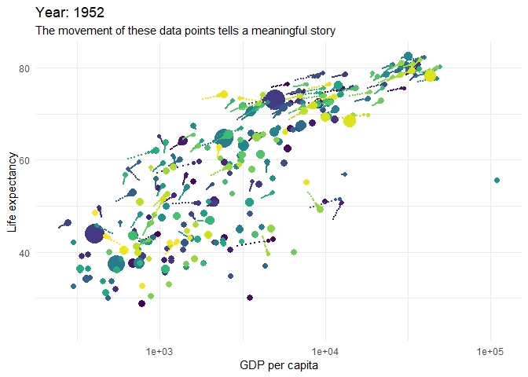

Following these guides and galleries can lead you from zero experience to mastering the key skills of data analysis and presentation with R.

## Learn to analyse data with R

__Learn R Code Skills:__ Learn RStudio and R code from zero knowledge to quite advanced by following [Modern R with the tidyverse](https://b-rodrigues.github.io/modern_R/). Another popular guide is [R for Data Science](https://r4ds.had.co.nz).

__Totally new to code or R? Scared you will fail and feel stupid?:__ If you've never coded before, or you have struggled to improve your R skills, consider paying for gentle guided learning created by DataCamp. The DataCamp [data analyst skill track](https://www.datacamp.com/tracks/data-analyst-with-r) takes you through 16 courses in a logical order. They assume no knowledge or skill. 

__Don't train too much. Do real analysis early:__ It can be tempting to complete many courses before you feel ready to try your own analysis. Instead, try writing your own simple analysis in R code as soon as you can, even if you don't feel ready. Replacing an Excel task you know well with R code is often a good first project. Ideally find a mentor to help you code your first projects. It's a quicker way to learn. Doing real things early is David Robinson's philosphoy. He explains it well in the section titled [Get students doing powerful things early](http://varianceexplained.org/r/teach-tidyverse/).

__Seek help often to become an independent problem solver:__ Don't hesitate to ask for help or toGoogle your problem or question. Getting better at solving your own problems in R using Google and other resources is an important skill to learn too, even when you're an expert R programmer. This [getting help in R](https://blog.rsquaredacademy.com/getting-help-in-r-updated/) blog summarises the best places to find help online. The more you look for help the better you become at judging which web sites and people can help you the most.

__Code Style:__ Write clear code that is easier to Quality Assure by following [The tidyverse style guide](https://style.tidyverse.org). You can also style your code automatically by running the [RStudio Styler add-in](http://styler.r-lib.org).

__Package Code:__ If your data analysis is regularly repeated or re-used, consider converting  it into a [Reproducible Analytical Pipeline (RAP)](https://ukgovdatascience.github.io/rap_companion/). Start to learn how to build a RAP by building the most simple [R Package](https://r-pkgs.org/index.html) possible first.

## Learn to visualise data with R

__Explore your data first:__ There are several tools let you explore your data interactively faster and easier than coding alone. For example:  

[esquisse](https://github.com/dreamRs/esquisse) is an RStudio "Addin" that launches this Point-and-Click interface that lets you build simple ggplot plots, as well as automatically generating the code for each plot you create. Even advanced R users can find ggplot code tricky so esquisse can be useful for everyone. Here is a long list of many more [RStudio Add-ins](https://github.com/daattali/addinslist). 

{width=60%}

[rpivotTable](https://cran.r-project.org/web/packages/rpivotTable/vignettes/rpivotTableIntroduction.html) is the R version of Excel's Pivot Tables and Charts. It's great for quickly exploring your data with heat maps, bar charts, line charts etc. in an R Markdown html output document.

{width=60%}
    
__Pick the right visualistion to tell your data story:__ Browse the [Fundamentals of Data Visualisation](https://serialmentor.com/dataviz/) guide by Claus Wilke to find the right visualisation for the point you are trying to make. The chapter on [telling a story and making a point](https://serialmentor.com/dataviz/telling-a-story.html) is particularly good. The charts in Wilke's book are written in R code that you can find in its [GitHub repository](https://github.com/clauswilke/dataviz). However, his book does not aim to teach R code skills. It is tool and language netural. For a good guide on how to create visualistions like Wilke's in R code start wtih the [graphs chapter](http://www.cookbook-r.com/Graphs/) in the [Cookbook for R](http://www.cookbook-r.com). 

__Learn to build ggplots easily step-by-step:__ If you are just starting to use ggplot, learn intuitively how to build up the code you need one line at a time with this [flipbook guide](https://evamaerey.github.io/ggplot_flipbook/ggplot_flipbook_xaringan.html#1). While [this flipbook](https://evamaerey.github.io/tidyverse_in_action/tidyverse_in_action.html#1) also includes some simple data preparation examples before building the charts step-by-step.

__Make your plots interactive:__ [Gallery of interactive R visualisations](http://gallery.htmlwidgets.org/). From this gallery, I strongly recommend trying the [dygraphs](http://rstudio.github.io/dygraphs/) package for time series charts and [Plotly](https://plot.ly/r/) for a huge variety of easy to code interactive charts.

__See if a ggplot extension helps your story:__ This [gallery of ggplot extensions](https://www.ggplot2-exts.org/gallery/) lets you create a greater variety of different plots that may better support your narrative.

__Consider animating your plots:__ If movement of data points in your plot will help better explain the story you are telling, animate it with [gganimate](https://github.com/billster45/gganimate-experiments/blob/master/README.md). Learn how to [animate ggplots intuitively](https://github.com/billster45/gganimate-experiments/blob/master/README.md) using my guide inspired by a good Twitter post.

```{r, echo=FALSE, warning=FALSE, message=FALSE, results="hide", eval=FALSE}
library(ggplot2)
library(gganimate)
library(transformr) # devtools::install_github("thomasp85/transformr")
library(magick)
library(gifski)
library(png)
library(gapminder)
library(cowplot)

p <- 
  ggplot2::ggplot(data = gapminder::gapminder) + 
  ggplot2::aes(x = gdpPercap, y=lifeExp, size = pop, colour = country) +
  ggplot2::geom_point(show.legend = FALSE) +
  ggplot2::scale_x_log10() +
  ggplot2::scale_color_viridis_d() +
  ggplot2::scale_size(range = c(2, 12)) +
  ggplot2::labs(x = "GDP per capita", y = "Life expectancy") +
  gganimate::transition_time(time = year) +
  ggplot2::labs(title = "Year: {frame_time}",
                subtitle = "The movement of these data points tells a meaningful story") +
  gganimate::shadow_wake(wake_length = 0.1, alpha = FALSE) +
  ggplot2::theme_minimal()
print(p)
gganimate::anim_save(filename = "./images/gapminder.gif")
```

{ width=70% }

## Putting it all together

__Watch a master at work:__ Even when you only have basic R code skills you will still benefit from watching how well an R expert rapidly explores and visualises data. David Robinson records live R coding videos in one hour on data he has never seen before. Here is a good example that explores [wind turbine locations](https://youtu.be/O1oDIQV6VKU) in the USA. It is one of the many [TidyTuesday](https://github.com/rfordatascience/tidytuesday) data sets he has coded live with you can search for on YouTube.

__Be creative, but follow these rules!__ While data visualisation allows creativity, exploration and personal expression, it is surprisingly easy to build bad or ugly visualisations. You must continually  criticise your own plots, and ask others to challenge your work. Use the rules in [The Office for National Satistics Data Visualisation guide](https://style.ons.gov.uk/category/data-visualisation/) to challenge your visualisations and then improve them. You can also find your visualisation type in Clause Wilke's [Fundamentals of Data Visualisation](https://serialmentor.com/dataviz/) book and see how his advice can improve your plot. This Medium post from The Economist called [Mistakes, we've drawn a few](https://medium.economist.com/mistakes-weve-drawn-a-few-8cdd8a42d368) is a good example of effective self-criticism.

```{r, echo=FALSE, warning=FALSE, message=FALSE, out.width = "60%"}
p1 <- 
  ggplot2::ggplot(data = datasets::airquality) +
  ggplot2::aes(x = Day, y = Temp,
               colour= as.factor(Month)) +
  ggplot2::geom_line(size = 1) +
  ggplot2::labs(title = "This plot is bad & Ugly",
                subtitle = "Air quality each day by month") 

p2 <- 
  ggplot2::ggplot(data = datasets::airquality) +
  ggplot2::aes(x = Day, y = Temp) +
  ggplot2::geom_line(size = 1) +
  ggplot2::geom_line(color = 'steelblue', size = 1) +
  ggplot2::facet_wrap(~Month, ncol = 2) +
  ggplot2::labs(title = "This plot is better, but it could still be imporved. How?",
                subtitle = "Air quality each day by month") +
  ggplot2::theme_minimal()
  
# https://cran.r-project.org/web/packages/cowplot/vignettes/introduction.html
plot2by2 <- cowplot::plot_grid(p1, p2,
                      labels=c("A", "B"), 
                      ncol = 2)

cowplot::save_plot("./images/plot2by2.png", plot2by2,
          ncol = 2,
          base_aspect_ratio = 1.3
          )
```

{ width=100% } 

__Present your final story:__ Your final story in a document of some kind (e.g. web page, Word or PowerPoint) is where you tell your engaging story. But often, you have spent so long with your data you will suffer from the [curse of knowledge](https://en.wikipedia.org/wiki/The_Sense_of_Style#The_curse_of_knowledge). You can no longer remember what it is like __not__ to know what you now know. Assume as little knowledge as possible in your final document to defeat this curse.

__Widen your auidence. Democratise:__ Defeating the curse of kowledge is hard. Unless you assume no prior knowledge, your writing, code and visualisations can turn off much far more of your audience than you realise. Or worse, mislead them. This style is not the same as dumbing down or over simplyifying. You can still present technical topics in this way. For example, here I have tried to explain [key Natural Language Processing techniques](https://github.com/billster45/NLP-Intuition/blob/master/README.md) in R code and data while assuming no prior technical knowledge. May aim is to help readers reach a satisfying and intuitive understanding. Don't be a gatekeeper of your knowledge and skills. It is better to democratise what you know while you move on to more complex work with a higher value (as proposed by Richard Susskind in [The Future of Professions](https://www.amazon.co.uk/dp/0198713398/)) 
