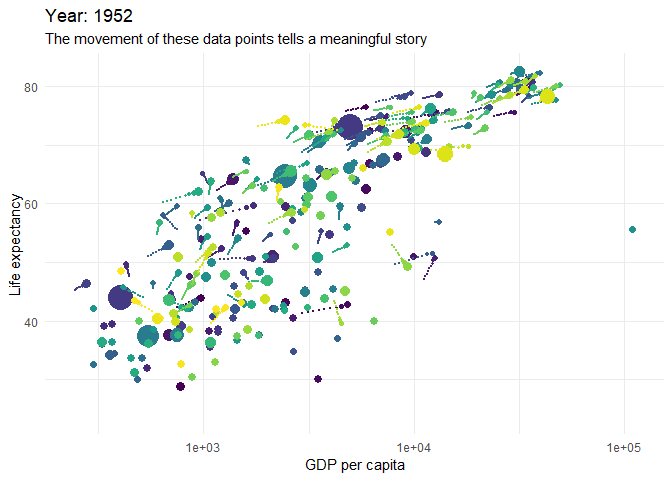
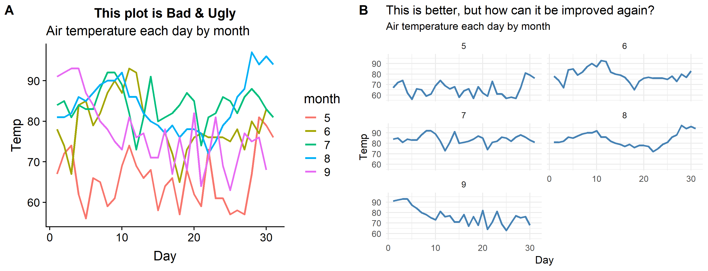

R guides & galleries for data analysis & presentation
================

-   [Learn to analyse data with R](#learn-to-analyse-data-with-r)
-   [Learn to visualise data with R](#learn-to-visualise-data-with-r)
-   [Putting it all together](#putting-it-all-together)

These guides and galleries can lead you from zero experience to mastering the key skills of data analysis and presentation with R. I've put them together to help anyone totally new to R (like I was not long ago). While I know a lot more now, I still regularly come back to all theses guides and galleries to learn more.

Learn to analyse data with R
----------------------------

**Learn data analysis R Skills from scratch:** Learn how to analyse data using RStudio from zero knowledge to quite advanced by following [Modern R with the tidyverse](https://b-rodrigues.github.io/modern_R/). Another popular guide is [R for Data Science](https://r4ds.had.co.nz).

**Totally new to code or R? Scared you will fail and feel stupid?:** If you've never coded before, or you have struggled to improve your R skills, consider paying for gentle guided learning created by DataCamp. The DataCamp [data analyst skill track](https://www.datacamp.com/tracks/data-analyst-with-r) takes you through 16 courses in a logical order. They assume no knowledge or skill.

**Don't train too much. Do real analysis early:** It can be tempting to complete many courses before you feel ready to try your own analysis. Instead, try writing your own simple analysis in R code as soon as you can, even if you don't feel ready. Replacing an Excel task you know well with R code is often a good first project. Ideally, find a mentor to help you code your first projects. It's a quicker way to learn. Doing real things early is David Robinson's philosophy. He explains it well in the section titled [Get students doing powerful things early](http://varianceexplained.org/r/teach-tidyverse/).

**Seek help often to become an independent problem solver:** Don't hesitate to ask for help or to Google your problem or question. Getting better at solving your own problems in R using Google and other resources is an important skill to learn too, even when you have become an expert R programmer. This [getting help in R](https://blog.rsquaredacademy.com/getting-help-in-r-updated/) blog summarises the best places to find help online. The more you look for help, the better you become at judging which web sites and people can help you the most.

**Write code in this clean style:** Write clear code that is easier to Quality Assure by following [The tidyverse style guide](https://style.tidyverse.org). You can also style your code automatically by running the [RStudio Styler add-in](http://styler.r-lib.org).

**Repeating the same analysis regularly? Consider converting to an R package:** If your data analysis is regularly repeated or re-used, consider converting it into a [Reproducible Analytical Pipeline (RAP)](https://ukgovdatascience.github.io/rap_companion/). Start to learn how to build a RAP by building the most simple [R Package](https://r-pkgs.org/index.html) possible first. However, packages are a more advanced topic. You won't need to build them if you are just starting out.

**Use GitHub to save your code:** Start saving your code on GitHub even when if you are just starting to learn R. This is called versioning your code. GitHub can be hard to learn if you start using it via the text commands typed at the command prompt. An easier way to learn GitHub with RStudio is through the menus and buttons as described in this good [Using git from Studio tutorial](https://nceas.github.io/oss-lessons/version-control/4-getting-started-with-git-in-RStudio.html). However, GitHub can also be fiddly to install and get working with RStudio too. This is why Jenny Bryan has written [Happy Git and GitHub for the useR](https://happygitwithr.com/) to help her students troubleshoot the many potential problems. Because of the many challenges with GitHub seek out an experienced GitHub with RStudio user who can coach you in person.

Learn to visualise data with R
------------------------------

**Explore your data first:** There are several R tools let you explore ata interactively that can be faster and easier than coding alone, particularly when you first start to learn R. For example:

[esquisse](https://github.com/dreamRs/esquisse) is an RStudio "Addin" that launches the Point-and-Click interface shown below. Use it to build simple ggplot plots. It also automatically generates the code you need for each plot you create with it. Even advanced R users can find ggplot code tricky so esquisse can be useful for everyone. Here is a long list of many more [RStudio Add-ins](https://github.com/daattali/addinslist).

[rpivotTable](https://cran.r-project.org/web/packages/rpivotTable/vignettes/rpivotTableIntroduction.html) is the R version of Excel's Pivot Tables and Charts. It's great for quickly exploring your data with heat maps, bar charts, line charts etc. in an R Markdown html output document.

**Make data exploration easy for yourself:** Claus Wilke makes a good case in his chapter [Data exploration versus data presentation](https://serialmentor.com/dataviz/choosing-visualization-software.html#data-exploration-versus-data-presentation) for using any tool that makes data exploration quick and easy for you. Use a different tool you know well to help you explore your data quickly. As you get better with R you will gradually use R code more to explore your data.

**Pick the right visualistion to tell your data story:** Browse the [Fundamentals of Data Visualisation](https://serialmentor.com/dataviz/) guide by Claus Wilke to find the right visualisation for the point you are trying to make. The charts in Wilke's book are written in R code that you can find in its [GitHub repository](https://github.com/clauswilke/dataviz). However, he didn't write his book to teach R code skills, it is tool and language neutral. For a good guide on how to create visualistions in R code start with the [graphs chapter](http://www.cookbook-r.com/Graphs/) in the [Cookbook for R](http://www.cookbook-r.com).

**Learn to build ggplots easily step-by-step:** If you are just starting to use ggplot, learn intuitively how to build up the code you need one line at a time with this [flipbook guide](https://evamaerey.github.io/ggplot_flipbook/ggplot_flipbook_xaringan.html#1). While [this flipbook](https://evamaerey.github.io/tidyverse_in_action/tidyverse_in_action.html#1) includes some simple data preparation code in addition before building the charts line by line.

**Make your plots interactive:** From the [Gallery of interactive R visualisations](http://gallery.htmlwidgets.org/) I strongly recommend [Plotly](https://plot.ly/r/) for a huge variety of easy to code interactive charts and [dygraphs](http://rstudio.github.io/dygraphs/) for easy to code time series charts. When partnered with ggplot, just these three packages are a very powerful data visualisation toolkit.

**See if a ggplot extension helps your story:** This [gallery of ggplot extensions](https://www.ggplot2-exts.org/gallery/) lets you create a greater variety of different plots that may better support your narrative. The most popular extension in this gallery is gganimate I describe next.

**Consider animating your plots:** If movement of data points in your plot will help better explain the story you are telling, animate it with [gganimate](https://github.com/billster45/gganimate-experiments/blob/master/README.md). Learn how to [animate ggplots intuitively](https://github.com/billster45/gganimate-experiments/blob/master/README.md) using my guide inspired by a good Twitter post.

Putting it all together
-----------------------

**Be creative - but don't break these rules!** It is surprisingly easy to build bad or ugly visualisations and not realise it could be better. Continually criticise your own plots. Ask others to challenge your work. Use the rules in [The Office for National Satistics Data Visualisation guide](https://style.ons.gov.uk/category/data-visualisation/) to check your visualisation does not break them. Find the type of visualisation you have made in the contents of Clause Wilke's [Fundamentals of Data Visualisation](https://serialmentor.com/dataviz/) book. See if his advice for your type of plot can improve it. This Economist post called [Mistakes, we've drawn a few](https://medium.economist.com/mistakes-weve-drawn-a-few-8cdd8a42d368) is a good example of effective self-criticism.

**Present your final story:** Tell an engaging data story in your final write up. This chapter on [telling a story and making a point](https://serialmentor.com/dataviz/telling-a-story.html) describes how to tell stories with visuals that engage and don't confuse your audience. On the Data Science competition website called Kaggle, browse the [Kaggle "kernels"](https://www.kaggle.com/kernels?sortBy=voteCount&group=everyone&pageSize=20&language=R) in R with the most votes to get ideas for powerful story telling in data. One of the most effective formats to tell your stor is [R Markdown](https://rmarkdown.rstudio.com/gallery.html), particulalry if you create interactive html document. Here is a [Quick Tour](https://rmarkdown.rstudio.com/authoring_quick_tour.html). Browse through the examples of others in [RPubs](https://rpubs.com/).

**Watch a master story teller use R:** Even with only basic R skills you can learn a lot from watching an R expert rapidly explore and visualise data to tell a story. David Robinson records live R coding videos in one hour on data he has never seen before. This good example explores [wind turbine locations](https://youtu.be/O1oDIQV6VKU) in the USA. It is one of the many [TidyTuesday](https://github.com/rfordatascience/tidytuesday) data sets he has coded live. [Search](http://lmgtfy.com/?q=david+robinson+youtube+tidy+tuesday) for his videos on YouTube.

**Telling good stories is hard:** You need to tell your data story to someone who doesn't know what you know about the data. But, after spending so long exploring the data set you can suffer from the [curse of knowledge](https://en.wikipedia.org/wiki/The_Sense_of_Style#The_curse_of_knowledge) when telling the story. It is suprisingly hard to remember what it was like to **not** know what you now know. This is why defeating the curse of knowledge is so difficult. Try to assume as little knowledge as possible in your final document. The more prior knowledge you assume, the more likely it is your text, code and visualisations lose your audience. Or even worse, you accidentally mislead them.

**Explain clearly. Democratise:** A clear plain style for your writing, code and visualisations is not dumbing down or over simplifying. You can still present technical topics. For example, here I have tried to explain [key Natural Language Processing techniques](https://github.com/billster45/NLP-Intuition/blob/master/README.md) in R while assuming no prior knowledge. Try not to be a gatekeeper of your growing R knowledge and skills. Share, explain and democratise what you know. You can then move on to more complex analysis in R with an even higher value (as proposed by Richard Susskind in [The Future of Professions](https://www.amazon.co.uk/dp/0198713398/)).
